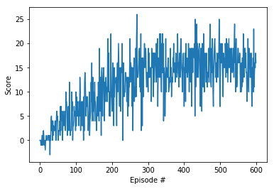

# Report 1: Navigation

## Learning Algorithm
I used basic DQN with three layered neural network. Here is my hyperparameter for the network.

### Hyperparameters
Parameter | Value
--- | ---
BUFFER_SIZE  |  1e5
BATCH_SIZE  |  64
GAMMA  |  0.99
TAU  |  1e-3
LR  |  5e-4
UPDATE_EVERY  |  4
max_n_episodes | 1500
max_t | 1000
eps_start | 1.0
eps_end | 0.01
eps_decay | 0.980

## History of Rewards
I observed history of score among 600 episodes as follows.

## Future Work
I need to investigate comparison results with double DQN, dueling DQN, and prioritized experience replay mehtods.
In addition, 