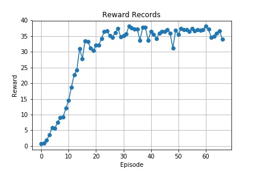

[image1]: https://user-images.githubusercontent.com/10624937/43851024-320ba930-9aff-11e8-8493-ee547c6af349.gif "Trained Agent"

# Project 2: Continuous Control

## Introduction
In this environment, a double-jointed arm can move to target locations. A reward of +0.1 is provided for each step that the agent's hand is in the goal location. Thus, the goal of your agent is to maintain its position at the target location for as many time steps as possible.

![Trained Agent][image1]

The observation space consists of 33 variables corresponding to position, rotation, velocity, and angular velocities of the arm. Each action is a vector with four numbers, corresponding to torque applicable to two joints. Every entry in the action vector should be a number between -1 and 1.

For this project, I will use the Unity environment which contains 20 identical reacher agents, each with its copy of the environment.

## Learning Algorithm

I use Deep Deterministic Policy Gradients (DDPG) method for training the agent in this reacher project. DDPG algorithm is one of schmes for Actor-Critic method. The following diagram shows the model's architectures for Actor-Critic method.


There are two models for this project : Actor and Critic. Here are configurations of them.

Actor Model:

1. Layer 1 : (33, 512) weight with leaky relu
1. Layer 2 : (512, 512) weight with leaky relu
1. Layer 3 : (512, 512) weight with leaky relu
1. Layer 4 : (512, 4) weight with tanh

Ceritic Model:

1. Layer 1 : (33, 512) weight with leaky relu
1. Layer 2 : (512+4, 512) weight with leaky relu (notice that it is added by action size)
1. Layer 3 : (512, 512) weight with leaky relu
1. Layer 4 : (512, 1) weight with no activation function

I used following hyper-parameters.
```
BUFFER_SIZE = int(1e5)  # replay buffer size
BATCH_SIZE = 128        # minibatch size
GAMMA = 0.99            # discount factor
TAU = 1e-2              # for soft update of target parameters
LR_ACTOR = 5e-5         # learning rate of the actor
LR_CRITIC = 5e-5        # learning rate of the critic
WEIGHT_DECAY = 0        # L2 weight decay
```

I realized that `TAU` is crucial for speeding up the training time. With proper values of learning rate(`LR_ACTOR` and `LR_CRITIC`), the very next thing you have to do is finding an optimal choice for `TAU` to boost the softupdate procedure.

## Result

The following plot shows score history as the agent's learning progresses.



The goal of this project is to obtain an averge score (over a hundred of episodes) greather than +30.0. In this figure, you can see a score greater than +30 at episode 67.

## Future works

I think this neural network is still big, unnecessarily. So I want to minimize the size of neural network while the agent's score maintains above +30. In addition, I want to apply another method for this project such as PPO or D4PG algorithms.