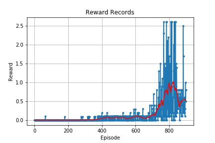

# Project 3: Collaboration and Competition

### Introduction

For this project, you will work with the [Tennis](https://github.com/Unity-Technologies/ml-agents/blob/master/docs/Learning-Environment-Examples.md#tennis) environment.

![Trained Agent][image1]

In this environment, two agents control rackets to bounce a ball over a net. If an agent hits the ball over the net, it receives a reward of +0.1.  If an agent lets a ball hit the ground or hits the ball out of bounds, it receives a reward of -0.01.  Thus, the goal of each agent is to keep the ball in play.

The observation space consists of 8 variables corresponding to the position and velocity of the ball and racket. Each agent receives its own, local observation.  Two continuous actions are available, corresponding to movement toward (or away from) the net, and jumping.

The task is episodic, and in order to solve the environment, your agents must get an average score of +0.5 (over 100 consecutive episodes, after taking the maximum over both agents). Specifically,

- After each episode, we add up the rewards that each agent received (without discounting), to get a score for each agent. This yields 2 (potentially different) scores. We then take the maximum of these 2 scores.
- This yields a single **score** for each episode.

The environment is considered solved, when the average (over 100 episodes) of those **scores** is at least +0.5.

## Learning Algorithm

I used Deep Deterministic Policy Gradients (DDPG) method for training the agent in this reacher project. DDPG algorithm is one of schmes for Actor-Critic method. The following diagram shows the model's architectures for Actor-Critic method.


There are two models for this project : Actor and Critic. Here are configurations of them.

Actor Model:

1. Layer 1 : (33, 512) weight with leaky relu
1. Layer 2 : (512, 512) weight with leaky relu
1. Layer 3 : (512, 512) weight with leaky relu
1. Layer 4 : (512, 4) weight with tanh

Ceritic Model:

1. Layer 1 : (33, 512) weight with leaky relu
1. Layer 2 : (512+4, 512) weight with leaky relu (notice that it is added by action size)
1. Layer 3 : (512, 512) weight with leaky relu
1. Layer 4 : (512, 1) weight with no activation function

I used following hyper-parameters.
```
BUFFER_SIZE = int(1e5)  # replay buffer size
BATCH_SIZE = 128        # minibatch size
GAMMA = 0.99            # discount factor
TAU = 1e-2              # for soft update of target parameters
LR_ACTOR = 5e-5         # learning rate of the actor
LR_CRITIC = 5e-5        # learning rate of the critic
WEIGHT_DECAY = 0        # L2 weight decay
```

I had two agents to be trained. They have the same purpose, so I set the identical network architecture defined above. In addition, the replay bueffers are also same with each others.

## Result

The following plot shows score history as the agent's learning progresses.



The goal of this project is to obtain an averge score (over a hundred of episodes) greather than +0.05. In this figure, you can see a score greater than +0.5 at episode 900. During first 600 episodes, there is no significant performance enhancement. After 700 episodes, score were becoming higher.

## Future works

I want to find a way to reduce time of high scores. I think this reduction is very important in practice.
In addition, I want to utilize diffenet methods for this project such as PPO or D4PG algorithms.